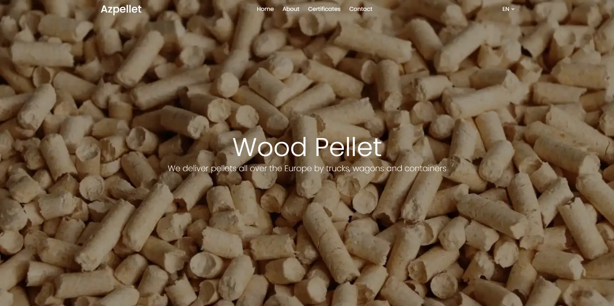

Azpellet is a platform dedicated to managing projects and providing educational resources. Our platform supports multiple languages to cater to a diverse user base.

## Table of Contents

- [Screenshots](#screenshots)
- [Features](#features)
- [Technologies Used](#technologies-used)
- [Installation](#installation)
- [License](#license)
- [Acknowledgements](#acknowledgements)

## Screenshots



## Features

- Responsive and mobile-friendly design
- Multi-language support (i18n)

## Technologies Used

- **React**: For building dynamic user interfaces.
- **Bootstrap**: For responsive and mobile-first design.
- **Sass**: For advanced and modular CSS.
- **Swiper**: For implementing touch sliders and carousels.
- **Framer Motion**: For creating animations and transitions.
- **AOS (Animate On Scroll)**: For scroll animations.
- **React Router DOM**: For routing and navigation management.
- **i18n**: For internationalization and multi-language support.
- **react-hook-form**: For form management.
- **yup**: For form validation.

## Installation

### Prerequisites

- Node.js (>= 14.x)
- npm or yarn

### Steps

1. **Clone the repository:**

   ```sh
   git clone https://github.com/Anrsgrl/azpellet
   ```

2. **Navigate to the project directory:**

   ```sh
   cd azpellet
   ```

3. **Install dependencies:**

   ```sh
   npm install
   # or
   yarn install
   ```

4. **Start the development server:**

   ```sh
   npm start
   # or
   yarn dev
   ```

## License

This project is licensed under the MIT License. See the [LICENSE](LICENSE) file for more details.

## Acknowledgements

This project was created some time ago and it was my first major project. There might be some mistakes, and I appreciate your understanding! Thank you for your support.
